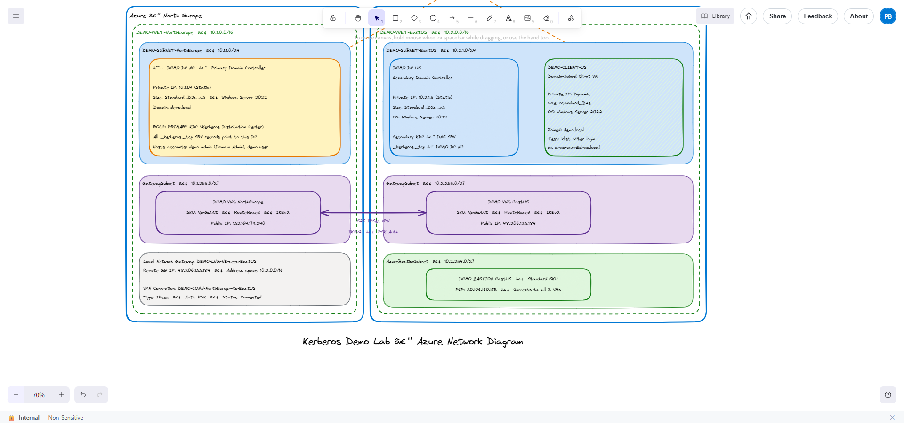

# Kerberos Lab — Azure Bastion + Domain Controllers

This lab deploys a demo environment to simulate **on-premises Kerberos authentication** across two Azure regions connected via S2S VPN, accessible through Azure Bastion.

## Architecture



## What's Deployed

| Resource | Region | Details |
|---|---|---|
| DEMO-VNET-NorthEurope | North Europe | 10.1.0.0/16 |
| DEMO-VNET-EastUS | East US | 10.2.0.0/16 |
| DEMO-VNG-NorthEurope | North Europe | VpnGw1AZ — S2S VPN |
| DEMO-VNG-EastUS | East US | VpnGw1AZ — S2S VPN |
| DEMO-BASTION-EastUS | East US | Standard SKU |
| **DEMO-DC-NE** ⭐ | North Europe | **Primary DC + Primary KDC** |
| DEMO-DC-US | East US | Secondary DC (SRV → NE) |
| DEMO-CLIENT-US | East US | Domain-joined test client |

## Kerberos Flow

```
DEMO-CLIENT-US (East US)
    │
    │  1. Kerberos auth request
    ▼
DEMO-DC-US (East US)
    │
    │  2. DNS SRV _kerberos._tcp → DEMO-DC-NE  (over S2S VPN)
    ▼
DEMO-DC-NE (North Europe) ← PRIMARY KDC
    │
    │  3. Issues Kerberos ticket
    ▼
DEMO-CLIENT-US receives TGT from North Europe
```

## Domain & Users

| Account | Role | UPN |
|---|---|---|
| `demo-admin` | Domain Admin | demo-admin@demo.local |
| `demo-user` | Standard user (Kerberos test) | demo-user@demo.local |

## Deployment

### Option 1 — Terraform
```bash
cd terraform/
cp terraform.tfvars.example terraform.tfvars
# Fill in passwords in terraform.tfvars
terraform init
terraform apply
```

### Option 2 — Bicep
```powershell
az group create --name 2605260050001177 --location northeurope
cd bicep/
.\deploy.ps1 -AdminPassword "..." -SafeModePassword "..." -VpnSharedKey "..." `
             -DomainAdminPassword "..." -DomainUserPassword "..."
```

## Post-Deployment Steps (via Bastion)

> ⚠️ AD DS promotion requires VM reboots — must be run manually via Bastion.

1. Connect to **DEMO-DC-NE** → run `scripts/01-setup-primary-dc.ps1`
2. After reboot → connect to **DEMO-DC-US** → run `scripts/02-setup-secondary-dc.ps1`
3. After reboot → connect to **DEMO-CLIENT-US** → run `scripts/03-join-domain.ps1`

## Verify Kerberos

On **DEMO-CLIENT-US**, after logging in as `demo-user@demo.local`:

```powershell
# SRV record should point to DEMO-DC-NE only
nslookup -type=srv _kerberos._tcp.demo.local

# Should return DEMO-DC-NE
nltest /dsgetdc:demo.local /kdc

# TGT should show KDC = 10.1.1.4 (DEMO-DC-NE, North Europe)
klist
```

## Files

```
kerberos/
├── README.md
├── diagrams/
│   ├── network-diagram.png
│   └── network-diagram.excalidraw
├── terraform/
│   ├── main.tf
│   ├── variables.tf
│   ├── outputs.tf
│   └── terraform.tfvars.example
├── bicep/
│   ├── main.bicep
│   ├── main.bicepparam
│   └── deploy.ps1
└── scripts/
    ├── 01-setup-primary-dc.ps1
    ├── 02-setup-secondary-dc.ps1
    └── 03-join-domain.ps1
```
